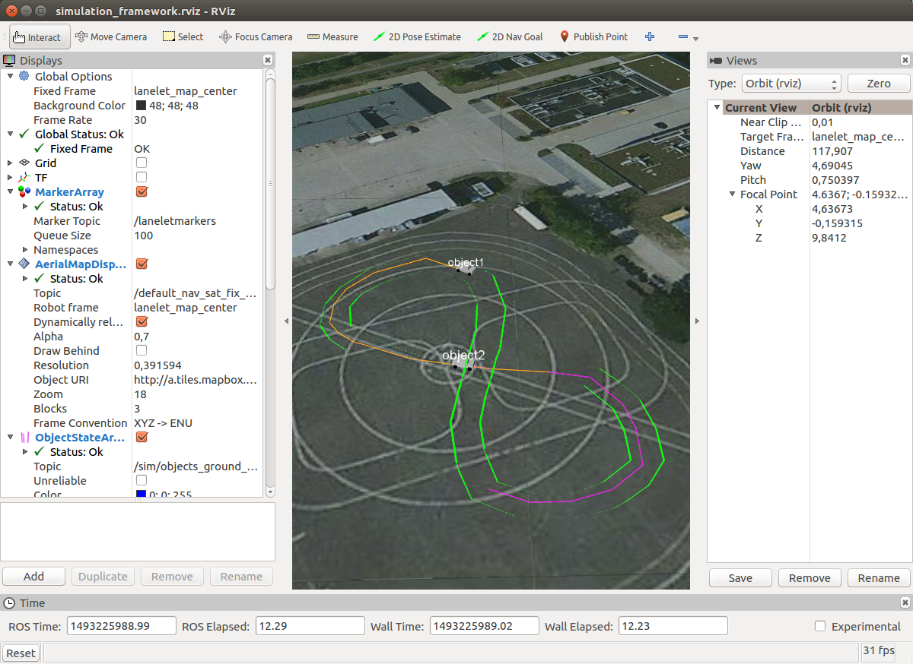

# ROS Simulation Framework

This is the main repository of the ROS Simulation Framework, developed within the Priority Program 1835 of the German Science Foundation (DFG).

## Installation
Installation requires Linux as operating system. The framework is developed and tested under [Ubuntu 16.04](http://releases.ubuntu.com/16.04/).

#### Prerequisites
In order to use the framework, you need to install the following packages (installable via `apt install`)
* ROS (see http://wiki.ros.org/ROS/Installation)
  * `ros-kinetic-desktop-full`
  * `ros-kinetic-geodesy`
  * `ros-kinetic-tf2-geometry-msgs`
* System Libraries
  * `libpugixml-dev`
  * boost and eigen are installed with ROS

#### Required repositories

External Dependencies
* [mrt_cmake_modules](https://github.com/KIT-MRT/mrt_cmake_modules)
* [rosparam_handler](https://github.com/cbandera/rosparam_handler)
* [automated_driving_msgs](https://github.com/fzi-forschungszentrum-informatik/automated_driving_msgs)
* [rviz_satellite](https://github.com/gareth-cross/rviz_satellite)

Parts of this Framework
* simulation_only_msgs
* simulation_initialization_ros_tool
* simulation_utils
* sim_sample_perception_ros_tool
* sim_sample_prediction_ros_tool
* sim_sample_planning_ros_tool
* sim_sample_communication_ros_tool
* sim_lanelet
* sim_lanelet_visualization_ros_tool
* object_state_array_rviz_plugin_ros

## Usage
#### 1a) Set up and build the workspace yourself
* set up a catkin workspace
  * ` $ mkdir catkin_ws && cd catkin_ws`
  * `catkin_ws$ wstool init`
  * `catkin_ws$ mkdir src && cd src`
* clone all repositories into the `src` folder of this workspace
  * `catkin_ws/src$ git clone <adress of repository>`
* build the workspace
  * `catkin_ws/src$ cd ..`
  * `catkin_ws$ catkin build`
* source the build-files
  * `catkin_ws$ source devel/setup.bash`

or
#### 1b) Use the script
* do the above steps by starting
  * ` $ ./setup_workspace.sh`

and then
#### 2) Launch the framework
* start the simulation framework by launching the main launchfile:
  * `catkin_ws$ roslaunch src/simulation_initialization_ros_tool/launch/_whole_framework.launch`
* for details, see package simulation_initialization_ros_tool

## License
Contact the maintainer of the respective package for license issues.
